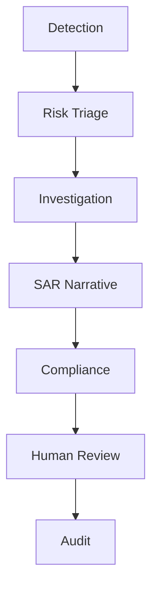

# Multi-Agent AI System for AML Detection and Reporting

**Team Zen · PES University capstone prototype**

A graph-based, human-in-the-loop prototype that turns the Elliptic Bitcoin transaction graph into evidence-backed investigation cases. It scores transaction nodes with a Graph Attention Network (GAT), explains the local model result, assembles source-traceable evidence, drafts a SAR-style report, validates the draft for grounding and provenance, and routes the case to a human reviewer with a persistent audit trail.

> **Research prototype.** Benchmark labels and model scores are not findings of criminal conduct. Model scores are uncalibrated. Report drafts are not filed SARs. No live KYC, sanctions, banking or production integration is claimed.

---

## Overview

Transaction-level monitoring can miss suspicious activity that is distributed across **connected transactions** rather than concentrated in a single record. This project takes a graph view: transactions are nodes and payment flows are directed edges, and a graph neural network scores a node in the context of its connected neighborhood.

The prototype implements a sequential, resumable workflow with **five AI agents** and two governance stages:

> Detection → Risk Triage → Investigation → SAR Narrative → Compliance → **Human Review** → **Audit**

The output is an investigation case containing a model score, a bounded connected-transaction neighborhood, a local model explanation, traceable evidence, a SAR-style draft and a validation report. A human investigator makes the final decision; the system never files a report on its own.

This is a capstone / research demonstration, not production AML software.

---

## Key features

- **Elliptic transaction graph ingestion** with strict schema, label and provenance validation.
- **Graph Neural Network detection** — a two-layer GAT that scores transaction nodes.
- **Connected-network context** — a bounded incoming two-hop neighborhood around each scored transaction.
- **Local model explanation** — GNNExplainer feature/edge attribution with an edge-deletion fidelity check.
- **Risk triage** — configurable severity thresholds plus stored network-structure signals.
- **Evidence retrieval and investigation dossier** — case-scoped, deduplicated, TF-IDF-ranked evidence with provenance.
- **SAR-style narrative generation** — deterministic cited-fact extraction, with optional local **FLAN-T5-small** constrained generation.
- **Compliance and traceability validation** — source rechecks, exact cited-fact (claim) validation, mandatory-disclosure checks and an internal readiness score.
- **SHAP cross-check** — SHAP explains the **independent logistic-regression baseline**, not the GAT.
- **Human review workflow** — Approve / Request changes / Reject, with required notes and revision checks.
- **Reopen for review** — an approved or rejected case can be reopened with a reason, preserving prior decisions.
- **Revision history and audit trail** — hash-linked audit events and per-revision snapshots (tamper-evident within the database).
- **Synthetic demo KYC / sanctions enrichment** — deterministic and clearly labelled synthetic data (never a model input).
- **SAR-style report export** — the investigator can export the SAR-style investigation report from the browser (print / save as PDF).
- **Two presentation modes** — a Judge Mode and a Technical Mode in the same web application.

---

## System workflow



The **five AI agents** are Detection, Risk Triage, Investigation, SAR Narrative and Compliance. **Human Review** and **Audit** are governance and control stages, not AI agents — the human reviewer holds final decision authority.

---

## Agents and stages

| Stage | Role | Input | Output | Technology |
|---|---|---|---|---|
| **Detection** (agent) | Score a transaction in its graph context and explain the local result | Elliptic transaction graph, target-time edges | Uncalibrated illicit-class score, bounded neighborhood, feature/edge attributions, fidelity check | PyTorch, PyTorch Geometric (`GATConv`, `GNNExplainer`) |
| **Risk Triage** (agent) | Prioritize the case using configured thresholds and stored network signals | Detection output | Severity (high / medium / low), priority, contributing factors, review-required flag | Deterministic policy (`TriageAgent`) |
| **Investigation** (agent) | Assemble case-scoped, source-traceable evidence and a dossier | Detection + triage output, benchmark graph | Evidence records, TF-IDF-retrieved context, structural findings, open questions, reference context | Python, scikit-learn TF-IDF |
| **SAR Narrative** (agent) | Produce an evidence-grounded SAR-style draft | Investigation dossier | Three sections of exact cited facts, optional constrained summary | Deterministic extraction, or local FLAN-T5-small (Transformers) |
| **Compliance** (agent) | Validate traceability, grounding and readiness | Detection, dossier, narrative | Findings, checklist, claim validation, readiness score, approval eligibility | Python source recheck; SHAP logistic-baseline cross-check |
| **Human Review** (governance) | Final human decision | Validated case | Approve / Request changes / Reject, or Reopen | FastAPI + web UI |
| **Audit** (governance) | Preserve history | Every stage and decision | Hash-linked events and revision snapshots | SQLite, SHA-256 |

---

## Architecture

The system is a single Python service with a browser front end:

- **Data ingestion** (`aml/data.py`) — strict Elliptic CSV ingestion with schema, ID, time-step, feature and manifest-hash checks. Labels are targets only and are never input features. Produces a graph object and a dataset fingerprint.
- **Graph construction** — transaction nodes with directed payment-flow edges; temporal split masks; target-time edge cutoffs for inference and case building.
- **Detection layer** (`aml/model.py`) — the GAT (`GATConv`) and an independent class-balanced logistic-regression baseline. Training uses only the local anonymized features.
- **Explanation layer** (`aml/explain.py`) — GNNExplainer local node/edge masks with a top-edge-deletion fidelity check; exact linear SHAP for the separate logistic baseline.
- **Triage** (`aml/agents.py` `TriageAgent`) — severity thresholds and neighborhood signals.
- **Investigation / evidence layer** (`aml/agents.py` `InvestigationAgent`, `aml/retrieval.py`, `aml/structure.py`, `aml/traceability.py`) — evidence assembly, TF-IDF retrieval, bounded structural summarization and source rechecking.
- **Narrative generation** (`aml/agents.py` `NarrativeAgent`) — deterministic extraction or local FLAN-T5-small constrained decoding, with generation provenance recorded.
- **Validation** (`aml/agents.py` `ComplianceAgent`) — consistency, claim grounding, mandatory disclosures and readiness checks.
- **Human review and audit** (`aml/pipeline.py`, `aml/store.py`) — review decisions, reopen, revisions and a hash-linked audit chain in SQLite (optionally Fernet-encrypted).
- **Backend API** (`aml/api.py`) — FastAPI application serving the JSON API and the static front end.
- **Web front end** (`web/`) — dependency-free HTML/CSS/JavaScript investigator desk with Judge Mode and Technical Mode.

---

## Dataset

The prototype uses the **Elliptic Bitcoin transaction dataset** as a benchmark.

| Property | Value |
|---|---|
| Nodes | 203,769 transactions |
| Directed edges | 234,355 payment-flow relationships |
| Time steps | 49 |
| Illicit labels | 4,545 |
| Licit labels | 42,019 |
| Unknown labels | 157,205 |

- Nodes represent **transactions**, not customers or accounts. Directed edges represent **payment flows between transactions**.
- Node features are **anonymized**. No customer identity, KYC, exact calendar date or interpretable currency amount is reconstructed, and no financial meaning is asserted for anonymous features.
- Unknown labels are kept as graph context but are **excluded** from the supervised loss and from evaluation metrics.

**Temporal split**

| Split | Time steps | Use |
|---|---|---|
| Train | ≤ 29 | Model fitting (train-only normalization) |
| Validation | 30–34 | Checkpoint and threshold selection |
| Evaluation | 35–49 | Held-out reporting (16,670 labeled transactions, including 1,083 illicit) |

The evaluation period was reused for fixed replication and is **not** a newly untouched final dataset. Results below are benchmark measurements, not production AML performance.

---

## Model and evaluation results

Three fixed seeds (17 / 29 / 43) were trained for 25 epochs with the original architecture, feature policy and optimizer. Unknown labels never enter the loss or metrics. AP is scikit-learn Average Precision (precision weighted by recall increase), not trapezoidal PR-AUC; SD is the sample standard deviation across three seeds.

| Model | Precision | Recall | Average Precision (AP) |
|---|---:|---:|---:|
| GAT (mean ± SD) | **0.154474 ± 0.008829** | **0.629732 ± 0.046855** | **0.233925 ± 0.020622** |
| Logistic baseline | 0.191597 | 0.804247 | 0.200893 |

In the benchmark evaluation, the GAT achieved higher mean AP than the logistic baseline, while the logistic baseline achieved higher precision and recall at its validation-selected operating point. These are different operating points, not a matched-recall comparison.

- The deployed checkpoint is the seed-17 GAT. Its alert threshold (0.74) was selected by validation F2; the baseline threshold is 0.77. No threshold is chosen from evaluation-period performance.
- These results are **benchmark measurements and should not be interpreted as production AML performance.** No business ROI, alert-reduction or production accuracy is claimed.
- The evaluation period was already observed during the project; the fixed replication does not create a new untouched population.

Reproduction helpers and full per-seed detail are in `docs/EVALUATION.md` and `docs/multiseed_evaluation.json`.

---

## Explanations

- **GNNExplainer** provides local feature and edge attribution for the **GAT detection output**, together with an edge-deletion fidelity check. Masks are model-derived attributions, not causal or legal proof.
- **SHAP** is an independent feature-attribution cross-check for the **logistic baseline only** (exact linear SHAP in log-odds). It does **not** explain the GAT and does not make the compliance decision.
- **SubgraphX is not implemented.** GNNExplainer supplies the graph attribution in this prototype.

---

## KYC / sanctions enrichment

The prototype includes **synthetic, clearly-labelled demo enrichment** for KYC profile fields and a static sanctions screening result (`aml/demo_enrichment.py`, and the isolated reference-provider contracts in `aml/reference.py`).

- It is **deterministic synthetic data**, labelled `DEMO / SYNTHETIC PROTOTYPE ENRICHMENT`.
- It is **never** an input to the GAT, never changes a model score, and is never written into benchmark evidence or provenance.
- It does **not** provide genuine customer KYC, live sanctions screening, production identity verification or live sanctions feeds. The demo sanctions list contains only fictional identifiers and reports "no match" rather than inventing a hit.

For non-synthetic data, a reference provider reports KYC and sanctions as **unavailable**.

---

## SAR-style reporting

The system produces a **SAR-style investigation report draft** — never a filed or submitted SAR.

- The narrative agent creates a `DRAFT` narrative built from exact cited evidence facts.
- Compliance validates that each claim is grounded in a cited record before the case can be approved.
- The human reviewer can export the SAR-style investigation report from the Evidence & Report view (rendered to a print view and saved as PDF via the browser). The exported draft is labelled *“Draft only · Human review required · Not a filed SAR.”*

**Human review is required before any reporting decision.** Approval records an internal prototype disposition and does **not** file a SAR.

---

## Human review and audit

Implemented review controls (`aml/pipeline.py`, `aml/store.py`):

- **Approve / Request changes / Reject** — require meaningful notes and an up-to-date revision. Approval is blocked while compliance findings remain.
- **Reopen for review** — an approved or rejected case can be reopened with a reason; a new revision is written and prior decisions are preserved.
- **Draft revision** — the structured narrative can be edited and is re-validated; generation provenance is server-owned and not rewritable by the editor.
- **Revision history** — narrative revisions and stage snapshots are retained.
- **Audit trail** — a hash-linked chain of stage, review and revision events, tamper-evident within the database. There is no external trusted anchor, so an administrator able to rewrite the whole database could recompute the chain.

**The human investigator retains final decision authority.**

---

## Technology stack

| Area | Technologies |
|---|---|
| Language | Python 3.12 (3.13 also runs) |
| Model / ML | PyTorch, PyTorch Geometric (`GATConv`, `GNNExplainer`), scikit-learn (logistic baseline, TF-IDF, metrics), SHAP, NumPy, pandas |
| Narrative model | Transformers + FLAN-T5-small, SentencePiece |
| Backend | FastAPI, Uvicorn, Pydantic, httpx (optional Ollama provider) |
| Storage | SQLite; optional Fernet encryption via `cryptography` |
| Front end | Dependency-free HTML / CSS / JavaScript |
| Testing | pytest (backend), Node.js built-in test runner (presentation) |

Exact pinned versions are in `requirements-lock.txt`; compatible ranges are in `requirements.txt`.

---

## Project structure

```text
AML/
├── aml/                     # backend: ingestion, GAT, explanations, agents, API, persistence
│   ├── data.py              #   Elliptic ingestion and graph construction
│   ├── model.py             #   GAT training and logistic baseline
│   ├── explain.py           #   GNNExplainer and baseline-only SHAP
│   ├── agents.py            #   the five agents
│   ├── pipeline.py          #   orchestration, review, reopen, revision
│   ├── store.py             #   SQLite snapshots and hash-linked audit
│   ├── retrieval.py         #   TF-IDF evidence retrieval
│   ├── structure.py         #   bounded network-structure summaries
│   ├── traceability.py      #   source rechecks and claim tracing
│   ├── demo_enrichment.py   #   synthetic demo KYC/sanctions
│   ├── reference.py         #   reference-provider contracts
│   ├── collection.py        #   label-independent demo collection
│   ├── config.py            #   settings
│   ├── api.py               #   FastAPI application
│   └── cli.py               #   inspect / train / evaluate / demo / synthetic
├── web/                     # investigator desk (HTML/CSS/JS; Judge + Technical modes)
├── scripts/                 # setup, startup, data/model download and verification
├── tests/                   # backend and presentation test suites
├── docs/                    # model card, system card, evaluation, validation, runbook
├── data/                    # Elliptic benchmark data (local)
├── artifacts/               # model checkpoint, case database, benchmark reports (local)
├── requirements.txt
├── requirements-lock.txt
├── pytest.ini
└── README.md
```

`data/`, `artifacts/` and local databases are generated/downloaded locally and are not committed to version control.

---

## Setup and running

Tested on Windows with Python 3.12 (3.13 also runs). Commands run from the repository root in **PowerShell**.

**1. Prerequisites**

- Python 3.12 (or 3.13) on `PATH`.
- Several GB of free disk space for the virtual environment, the Elliptic CSVs and the optional local language model.
- No GPU, Node.js or front-end build is required to run the application.

**2. Environment setup and dependencies**

```powershell
./scripts/setup.ps1
```

`setup.ps1` creates `.venv` if needed and installs the pinned dependencies from `requirements-lock.txt`. To use a specific interpreter:

```powershell
./scripts/setup.ps1 -Python "C:\path\to\python.exe"
```

Manual equivalent:

```powershell
python -m venv .venv
.\.venv\Scripts\python.exe -m pip install -r requirements-lock.txt
```

**3. Required data and model preparation**

- The Elliptic CSVs are expected under `data/elliptic/raw/` (`elliptic_txs_features.csv`, `elliptic_txs_edgelist.csv`, `elliptic_txs_classes.csv`, plus `manifest.json`). See *Data preparation* below.
- The GAT checkpoint and benchmark reports are expected under `artifacts/benchmark/`.
- The narrative providers are described in *Local narrative model* below.

**4. Start the application**

```powershell
./scripts/start.ps1 -Port 8002 -NarrativeProvider local
```

`-NarrativeProvider` accepts `extractive` (default, deterministic), `local` (FLAN-T5-small) or `ollama`. `-Port` defaults to 8000 when omitted; 8002 is the verified demonstration port.

**5. Open the application**

```text
http://127.0.0.1:8002
```

Initial data/model loading is lazy and may take a short while on first use. The raw server equivalent is:

```powershell
.\.venv\Scripts\python.exe -m uvicorn aml.api:app --host 127.0.0.1 --port 8002
```

---

## Data preparation

The repository expects the genuine Elliptic dataset, not synthetic data.

```powershell
New-Item -ItemType Directory -Force data/elliptic/raw | Out-Null
Invoke-WebRequest -Uri 'https://www.kaggle.com/api/v1/datasets/download/ellipticco/elliptic-data-set' -OutFile 'data/elliptic/elliptic.zip'
.\.venv\Scripts\python.exe scripts/unpack_data.py
.\.venv\Scripts\python.exe -m aml.cli inspect
```

`scripts/download_data.py` supports the official PyG mirror as an alternative source. Missing files, malformed schemas and declared checksum mismatches fail explicitly.

CLI commands:

```powershell
.\.venv\Scripts\python.exe -m aml.cli inspect
.\.venv\Scripts\python.exe -m aml.cli train --epochs 25
.\.venv\Scripts\python.exe -m aml.cli evaluate
.\.venv\Scripts\python.exe -m aml.cli demo --cases 4
```

`scripts/verify_capstone.py` reproduces the four demonstration cases in a fresh database for independent verification.

---

## Local narrative model

The optional `local` narrative provider uses **FLAN-T5-small** loaded from disk with no runtime network access. It selects a grounded two-fact summary from retrieved evidence using constrained (prefix-constrained greedy) decoding, and the output is validated against the candidate facts.

- The model is expected at `artifacts/flan-t5-small/` (configurable with `AML_LLM_MODEL`).
- Model weights are **not** included in the repository; obtain them once with one of:

```powershell
.\.venv\Scripts\python.exe scripts/download_llm.py
# or a pinned download:
.\.venv\Scripts\python.exe scripts/download_llm_direct.py
```

- The Kaggle distribution can also be unpacked with `scripts/unpack_llm.py` (the archive is not shipped in the repository).
- Without the model, use the default `extractive` provider, which copies actual cited facts into the structured sections.

This provider is deliberately **extractive** — it is not unrestricted free-form report synthesis.

---

## API (selected endpoints)

| Method | Path | Purpose |
|---|---|---|
| GET | `/api/health`, `/api/status` | Service and configuration status |
| GET | `/api/model` | Model identity and checkpoint provenance |
| GET | `/api/overview` | Dataset, evaluation and validation summaries |
| GET | `/api/demo-collection` | Verified, label-independent demonstration collection |
| GET | `/api/cases` | List stored cases |
| POST | `/api/cases` | Create a case for a transaction |
| GET | `/api/cases/{id}` | Case detail (all stage outputs) |
| GET | `/api/cases/{id}/audit` | Audited event chain |
| GET | `/api/cases/{id}/narrative-history` | Narrative revision history |
| GET | `/api/cases/{id}/transactions/{tx}` | Anonymous source attributes for a transaction |
| GET | `/api/cases/{id}/demo-enrichment` | Synthetic demo KYC / sanctions |
| POST | `/api/cases/{id}/retry` | Resume a failed case |
| POST | `/api/cases/{id}/review` | Approve / request changes / reject |
| POST | `/api/cases/{id}/reopen` | Reopen an approved or rejected case |
| PUT | `/api/cases/{id}/narrative` | Save a revised draft and revalidate |

---

## Security and privacy

- The benchmark data is **anonymous**; no real customer KYC, identities or sanctions records are included.
- The synthetic demo enrichment is **fictional** and must not be treated as real customer information.
- With no tokens configured, the app runs as a **loopback demo** that accepts only local connections. Setting `AML_ANALYST_TOKEN` and `AML_REVIEWER_TOKEN` enables bearer-role authorization (only reviewers may decide).
- Responses set `Content-Security-Policy`, `X-Content-Type-Options: nosniff` and `Cache-Control: no-store`; cross-origin mutations are rejected.
- Case, snapshot and audit payloads can optionally be encrypted with a Fernet key (`AML_ENCRYPTION_KEY`).
- **Never commit secrets.** Keep API keys, tokens, encryption keys and environment-specific values out of version control; use local environment variables (see `.env.example`).

---

## Testing

Backend (pytest):

```powershell
.\.venv\Scripts\python.exe -m pytest -q --basetemp artifacts/new-pytest-run -o cache_dir=artifacts/pytest-cache
```

Front-end / presentation (Node.js built-in test runner):

```powershell
node --test tests/ui_presentation.test.cjs
```

Tests create small **synthetic test graphs** in temporary directories; their metrics are software checks and are not benchmark results. `pytest.ini` restricts collection to `tests/`.

---

## Limitations

- Benchmark prototype, **not production AML software** or a regulatory filing system.
- Uses the historical, anonymous **Elliptic Bitcoin** dataset, not live fiat banking data; anonymous features have no asserted financial meaning.
- Model scores are **uncalibrated** and limit threshold interpretation.
- No genuinely new prospective or external evaluation population; the evaluation period was reused for fixed replication.
- Genuine customer **KYC is unavailable** and **live sanctions screening is not integrated**; enrichment is synthetic/demo only.
- **No automatic SAR filing**; every reporting decision requires human review.
- No production case-management or bank/SAR-system integration.
- **SubgraphX is not implemented**; GNNExplainer supplies graph attribution.
- No production drift monitoring or production workload validation.
- The local audit chain is tamper-evident within the database but has no external trusted anchor.

These are scope boundaries of a research prototype, stated for transparency.

---

## Future scope

- Adapt to fiat transaction data and institution-specific schemas.
- Prospective evaluation on institutional data with a predeclared protocol.
- Probability calibration and operating-point analysis before any deployment claim.
- Drift monitoring.
- Live KYC and sanctions/reference integrations behind explicit provider contracts.
- Subgraph-level explanation methods (for example SubgraphX).
- Production case-management integration and deployment hardening.

---

## Project status

**Capstone prototype / research demonstration.**

- Working end-to-end prototype: Detection → Risk Triage → Investigation → SAR Narrative → Compliance → Human Review → Audit.
- Benchmark evaluation completed and reported.
- Human-in-the-loop review with a persistent audit trail.
- **Not** production AML software and **not** a regulatory filing system.

---

## Documentation

| Document | Contents |
|---|---|
| `docs/CAPSTONE_DEMO.md` | Evaluator walkthrough and demonstration steps |
| `docs/EVALUATION.md` | Evaluation protocol and measured results |
| `docs/VALIDATION.md` | Validation and verification record |
| `docs/MODEL_CARD.md` | Model details, intended use and limits |
| `docs/SYSTEM_CARD.md` | System-level description and scope |
| `docs/SECURITY_PRIVACY_REVIEW.md` | Security and privacy review |
| `docs/IMPLEMENTATION_DECISIONS.md` | Design decisions and deferred work |
| `docs/JUDGE_UX_DECISIONS.md` | Presentation-mode and case-workflow decisions |
| `PROJECT_STATUS.md` | Current engineering status |
| `CHANGELOG.md` | Milestone history |
| `AML_Project_Master_Specification.md` | Original proposal / scope reference |

---

**Team Zen · PES University — capstone research prototype.**
